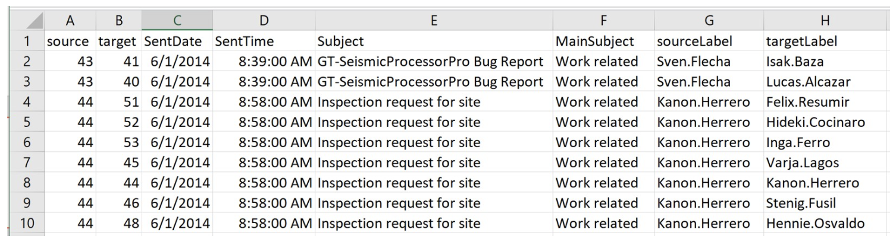
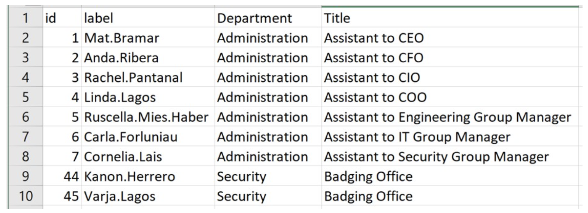
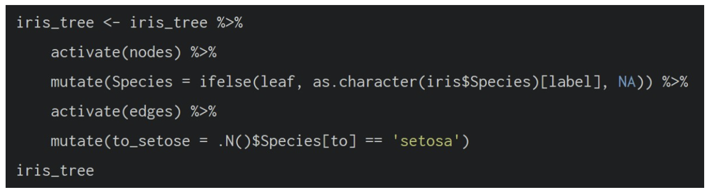
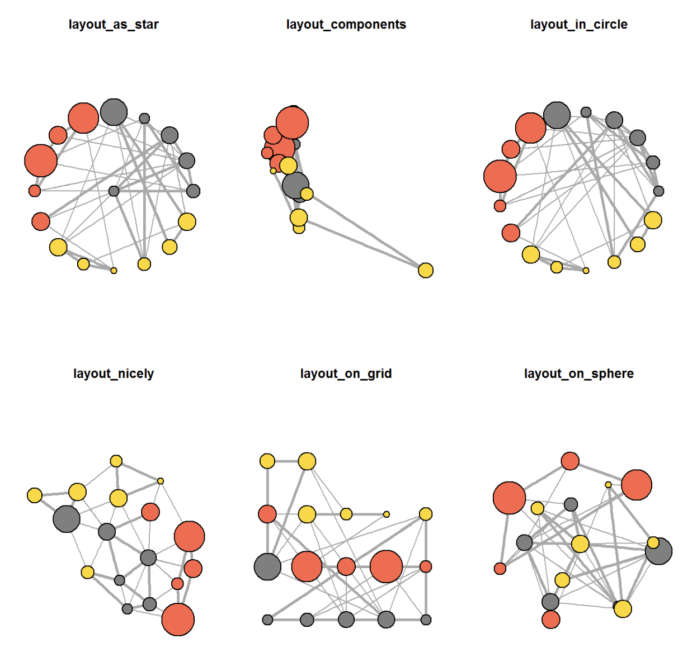
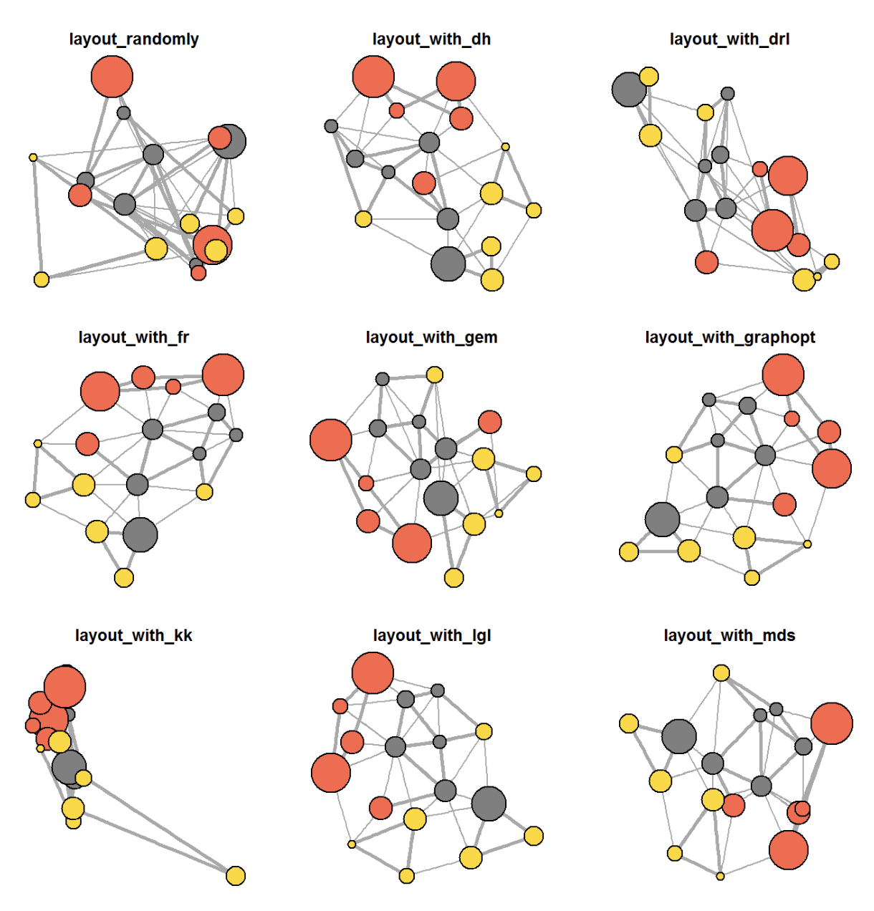

# 1. Overview

In this exercise, we explore how to:

-   Create graph object data frames and manipulate them using dplyr, lubridate, and tidygraph.

-   Build network graph visualizations using ggraph.

-   Compute network metrics using tidygraph

-   Develop advanced graph visualizations by incorporating network metrics.

-   Create interactive network visualizations using the visNetwork package.

# 2. Getting Started

## 2.1 Installing and launching R packages

In this hands-on exercise, four network data modelling and visualisation packages will be installed and launched. They are igraph, tidygraph, ggraph and visNetwork. Beside these four packages, tidyverse and [lubridate](https://lubridate.tidyverse.org/), an R package specially designed to handle and wrangling time data will be installed and launched too.

The below code chunk loads in the relevant R packages.

```{r}
pacman::p_load(igraph, tidygraph, ggraph, 
               visNetwork, lubridate, clock,
               tidyverse, graphlayouts)
```

# 3. The Data
The data sets used in this hands-on exercise is from an oil exploration and extraction company. There are two data sets. One contains the nodes data and the other contains the edges (also know as link) data.

## 3.1. The edges data

-   *GAStech-email_edges.csv:* consists of 2 weeks of 9063 emails correspondances between 55 employees.



## 3.2. The nodes data

-   *GAStech_email_nodes.csv*: consist of the names, department and title of the 55 employees.



## 3.3. Importing network data from files

Next we import GAStech_email_node.csv and GAStech_email_edges-v2.csv into R environment using `read_csv().`

```{r}
GAStech_nodes <- read_csv("data/GAStech_email_node.csv")
GAStech_edges <- read_csv("data/GAStech_email_edge-v2.csv")
```

## 3.4. Reviewing the imported data

The below code chunk shows the structure of the data frame using `glimpse()`

```{r}
glimpse(GAStech_edges)
```

::: {.callout-warning title="Warining"}

The output report of GAStech_edges indicates that the SentDate field is incorrectly treated as a "Character" data type instead of a "Date" data type. Before proceeding, it is crucial to convert the SentDate field back to the proper Date data type.
:::

## 3.5. Wrangling time

The below code chunk performs the necessary changes.

```{r}
GAStech_edges <- GAStech_edges %>%
  mutate(SendDate = dmy(SentDate)) %>%
  mutate(Weekday = wday(SentDate,
                        label = TRUE,
                        abbr = FALSE))
```

::: {.callout-tip title="Key takeaways from above code chunk:"}

-   dmy() and wday() are functions from the lubridate package, which simplifies working with dates and times in R.
-   dmy() converts the SentDate field into the Date data type.
-   wday() extracts the day of the week from a date. When the label argument is set to TRUE, it returns the weekday as an ordered factor. Setting abbr = FALSE ensures the full weekday name (e.g., "Monday") is displayed.
-   The function creates a new column, Weekday, in the data frame, storing the output of wday().
-   Values in the Weekday field are on an ordinal scale, meaning they have a meaningful order (e.g., Monday before Tuesday).
:::

## 3.6. Reviewing the revised date fields

The below code chunk shows the data structure of the reformatted `GAStech_edges` data frame.

```{r}
glimpse(GAStech_edges)
```

## 3.7. Wrangling attributes

A detailed examination of the GAStech_edges data frame reveals that it contains individual email flow records. However, visualizing data at this granular level may not be meaningful.

To enhance interpretability, we will aggregate the email records based on key attributes, including date, sender, receiver, main subject, and day of the week.

The following code chunk will perform this aggregation, transforming the dataset into a more structured format suitable for visualization and analysis.

```{r}
GAStech_edges_aggregated <- GAStech_edges %>%
  filter(MainSubject == "Work related") %>%
  group_by(source, target, Weekday) %>%
    summarise(Weight = n()) %>%
  filter(source!=target) %>%
  filter(Weight > 1) %>%
  ungroup()
```

::: {.callout-tip title="Key takeaways from above code chunk:"}

-   dplyr Functions Used: The code utilizes four key functions from the dplyr package: `filter()`, `group_by()`, `summarise()`, `ungroup()`
-   Output Data Frame: The transformed dataset is stored in a new data frame named GAStech_edges_aggregated.
-   New Field Added: A new column, Weight, has been introduced to quantify the aggregated relationships, enhancing the dataset's suitability for network analysis.
:::

## 3.8. Reviewing the revised edges file

The below code chunk shows the data structure of the reformatted `GAStech_edges` data frame.

```{r}
glimpse(GAStech_edges_aggregated)
```

# 4. Creating network objects using tidygraph

In this section, we explore how to create a graph data model using the tidygraph package, which provides a tidy API for graph and network manipulation.

While network data is inherently not tidy, it can be structured as two tidy tables:

-   Node table – contains information about entities (nodes)

-   Edge table – captures relationships between entities (edges).

tidygraph enables seamless transitions between these two tables, allowing for efficient data manipulation using familiar dplyr verbs. It also provides access to a wide range of graph algorithms, returning results in a format compatible with a tidy workflow.

Before diving into the implementation, it is recommended to explore the following articles:

-   [Introducing tidygraph](https://www.data-imaginist.com/2017/introducing-tidygraph/)

-   [tidygraph 1.1 - A tidy hope](https://www.data-imaginist.com/2018/tidygraph-1-1-a-tidy-hope/)

## 4.1. The tbl_graph object

The **tidygraph** package provides two primary functions for creating network objects:

1.  `tbl_graph()` – Creates a `tbl_graph` network object from separate nodes and edges data frames.

2.  `as_tbl_graph()` – Converts various network data structures into a `tbl_graph` object.

## 4.2. The dplyr verbs in tidygraph

- `activate()` verb from tidygraph serves as a switch between tibbles for nodes and edges. All dplyr verbs applied to tbl_graph object are applied to the active tibble.


- In the above the `.N()` function is used to gain access to the node data while manipulating the edge data. Similarly `.E()` will give you the edge data and `.G()` will give you the tbl_graph object itself.

## 4.3. Using `tbl_graph()` to build tidygraph data model.

Next we explore how to use `tbl_graph()` of **tinygraph** package to build an tidygraph’s network graph data.frame.

```{r}
GAStech_graph <- tbl_graph(nodes = GAStech_nodes,
                           edges = GAStech_edges_aggregated, 
                           directed = TRUE)
```

## 4.4. Reviewing the output tidygraph’s graph object

```{r}
GAStech_graph
```

## 4.5. Reviewing the output tidygraph’s graph object

The output above indicates that GAStech_graph is a tbl_graph object containing 54 nodes and 4,541 edges.

Additionally, the command prints:

-   The first six rows of the Node Data

-   The first three rows of the Edge Data

It also specifies that the Node Data is currently active.

In tidygraph, the concept of an active tibble within a `tbl_graph` object allows users to manipulate data in either the node or edge table independently, ensuring a structured and efficient workflow.

## 4.6. Changing the active object

By default, the nodes tibble data frame is activated in a `tbl_graph` object. However, you can switch between the nodes and edges data frames using the `activate()` function.

For instance, if you want to rearrange the rows in the edges tibble to list those with the highest "weight" first, you can use `activate()` to switch to the edges data frame and then apply `arrange()` to sort the values accordingly.

```{r}
GAStech_graph %>%
  activate(edges) %>%
  arrange(desc(Weight))
```

# 5. Plotting Static Network Graphs with ggraph package

[**ggraph**](https://ggraph.data-imaginist.com/) is an extension of **ggplot2**, making it easier to carry over basic ggplot skills to the design of network graphs.

As in all network graph, there are three main aspects to a **ggraph**’s network graph:

-   [nodes](https://cran.r-project.org/web/packages/ggraph/vignettes/Nodes.html),

-   [edges](https://cran.r-project.org/web/packages/ggraph/vignettes/Edges.html) and

-   [layouts](https://cran.r-project.org/web/packages/ggraph/vignettes/Layouts.html).

## 5.1. Plotting a basic network graph

The code chunk below uses [*ggraph()*](https://ggraph.data-imaginist.com/reference/ggraph.html), [*geom-edge_link()*](https://ggraph.data-imaginist.com/reference/geom_edge_link.html) and [*geom_node_point()*](https://ggraph.data-imaginist.com/reference/geom_node_point.html) to plot a network graph by using *GAStech_graph.*

```{r}
ggraph(GAStech_graph) +
  geom_edge_link() +
  geom_node_point()
```

::: {.callout-tip title="Key takeaways from above code chunk:"} 
The fundamental plotting function for network visualization in R is `ggraph()`, which requires two key arguments:

1.  Data – the network graph object to be visualized.

2.  Layout – the method used to position the nodes in the graph.

Both arguments in `ggraph()` are built around igraph, meaning that `ggraph()` can accept either an igraph object or a tbl_graph object created using the **tidygraph** package.
:::

## 5.2. Changing the default network graph theme

Next we use [*theme_graph()*](https://ggraph.data-imaginist.com/reference/theme_graph.html) to remove the x and y axes.

```{r}
g <- ggraph(GAStech_graph) + 
  geom_edge_link(aes()) +
  geom_node_point(aes())

g + theme_graph()
```

::: {.callout-tip title="Key takeaways from above code chunk:"}
`ggraph` introduces a specialized ggplot theme designed specifically for network visualizations, offering improved defaults compared to standard `ggplot2` themes.

Key Features of `theme_graph()`:

-   Removes axes, grid lines, and borders, which are unnecessary for network graphs.

-   Changes the default font to Arial Narrow (this can be customized if needed).

-   To apply the theme globally across multiple plots, use `set_graph_style()` before plotting

-   To apply the theme to an individual plot, include `theme_graph()` within the `ggraph()` pipeline.

:::

## 5.3. Changing the coloring of the plot

The below code chunk uses `theme_graph()` to change the coloring of the plot.

```{r}
g <- ggraph(GAStech_graph) + 
  geom_edge_link(aes(colour = 'grey50')) +
  geom_node_point(aes(colour = 'grey40'))

g + theme_graph(background = 'grey10',
                text_colour = 'white')
```

## 5.4. Working with ggraph’s layouts

**ggraph** support many layout for standard used: star, circle, nicely (default), dh, gem, graphopt, grid, mds, spahere, randomly, fr, kk, drl and lgl




## 5.5.Fruchterman and Reingold layout

The code chunks below plots the network graph using Fruchterman and Reingold layout.

```{r}
g <- ggraph(GAStech_graph, 
            layout = "fr") +
  geom_edge_link(aes()) +
  geom_node_point(aes())

g + theme_graph()
```

## 5.6. Modifying network nodes

In this section, we colour each node by referring to their respective departments.

```{r}
g <- ggraph(GAStech_graph, 
            layout = "nicely") + 
  geom_edge_link(aes()) +
  geom_node_point(aes(colour = Department, 
                      size = 3))

g + theme_graph()
```

`geom_node_point()` in `ggraph` functions similarly to `geom_point()` in `ggplot2`, allowing for the visualization of nodes in a network graph. This function enables customization of node appearance using different shapes, colors, and sizes.

In the code chunks above, color and size were utilized to enhance the distinction between nodes, making the graph more interpretable and visually appealing.

## 5.7. Modifying edges

The code chunk below maps the thickness of the edges with the *Weight* variable.

```{r}
g <- ggraph(GAStech_graph, 
            layout = "nicely") +
  geom_edge_link(aes(width=Weight), 
                 alpha=0.2) +
  scale_edge_width(range = c(0.1, 5)) +
  geom_node_point(aes(colour = Department), 
                  size = 3)

g + theme_graph()
```

`geom_edge_link()` is the simplest way to visualize edges in a network graph by drawing straight lines between connected nodes. However, it offers additional customization options.

In the example above:

-   The `width` argument is used to proportionally scale the line width based on the `Weight` attribute, making stronger connections more prominent.

-   The `alpha` argument introduces opacity, allowing for better visibility of overlapping edges and enhancing the overall clarity of the graph.

# 6. Creating facet graphs

One of the most powerful features of `ggraph` is faceting, which helps reduce edge over-plotting by spreading nodes and edges across multiple panels based on their attributes.

Faceting functions in `ggraph`:

1.  `facet_nodes()` – Edges are drawn only if both terminal nodes are present in the same facet panel.

2.  `facet_edges()` – Nodes are always drawn in all panels, even if the edge attribute used for faceting is absent in the node data.

3.  `facet_graph()` – Supports simultaneous faceting on two variables, allowing for more complex network visualizations.

By leveraging these faceting techniques, network graphs become clearer and more interpretable, particularly in cases where dense connectivity makes individual relationships hard to distinguish.

## 6.1. Working with *facet_edges()*

```{r}
set_graph_style()

g <- ggraph(GAStech_graph, 
            layout = "nicely") + 
  geom_edge_link(aes(width=Weight), 
                 alpha=0.2) +
  scale_edge_width(range = c(0.1, 5)) +
  geom_node_point(aes(colour = Department), 
                  size = 2)

g + facet_edges(~Weekday)
```

## 6.2. Working with *facet_edges()*

The code chunk below uses *theme()* to change the position of the legend.

```{r}
set_graph_style()

g <- ggraph(GAStech_graph, 
            layout = "nicely") + 
  geom_edge_link(aes(width=Weight), 
                 alpha=0.2) +
  scale_edge_width(range = c(0.1, 5)) +
  geom_node_point(aes(colour = Department), 
                  size = 2) +
  theme(legend.position = 'bottom')
  
g + facet_edges(~Weekday)
```

## 6.3. A framed facet graph

The code chunk below adds frame to each graph.

```{r}
set_graph_style() 

g <- ggraph(GAStech_graph, 
            layout = "nicely") + 
  geom_edge_link(aes(width=Weight), 
                 alpha=0.2) +
  scale_edge_width(range = c(0.1, 5)) +
  geom_node_point(aes(colour = Department), 
                  size = 2)
  
g + facet_edges(~Weekday) +
  th_foreground(foreground = "grey80",  
                border = TRUE) +
  theme(legend.position = 'bottom')
```

## 6.4. Working with *facet_nodes()*

```{r}
set_graph_style()

g <- ggraph(GAStech_graph, 
            layout = "nicely") + 
  geom_edge_link(aes(width=Weight), 
                 alpha=0.2) +
  scale_edge_width(range = c(0.1, 5)) +
  geom_node_point(aes(colour = Department), 
                  size = 2)
  
g + facet_nodes(~Department)+
  th_foreground(foreground = "grey80",  
                border = TRUE) +
  theme(legend.position = 'bottom')
```

# 7. Network Metrics Analysis

## 7.1. Computing centrality indices

Centrality measures are statistical indices used to determine the relative importance of actors within a network. The four well-known centrality measures are:

1.  Degree Centrality – Measures the number of direct connections an actor has.

2.  Betweenness Centrality – Captures the extent to which an actor lies on the shortest paths between other actors, indicating its role as a bridge.

3.  Closeness Centrality – Reflects how easily an actor can reach all other actors in the network, based on the shortest paths.

4.  Eigenvector Centrality – Assigns importance to an actor based on the importance of its connections.

```{r}
g <- GAStech_graph %>%
  mutate(betweenness_centrality = centrality_betweenness()) %>%
  ggraph(layout = "fr") + 
  geom_edge_link(aes(width=Weight), 
                 alpha=0.2) +
  scale_edge_width(range = c(0.1, 5)) +
  geom_node_point(aes(colour = Department,
            size=betweenness_centrality))
g + theme_graph()
```

-   *mutate()* of **dplyr** is used to perform the computation.

-   the algorithm used is the *centrality_betweenness()* of **tidygraph**.

## 7.2. Visualising network metrics

From ggraph v2.0 onward, tidygraph algorithms, including centrality measures, can be accessed directly within ggraph calls. This eliminates the need to precompute and store derived node and edge centrality measures before using them in visualizations, streamlining the workflow for network analysis.

```{r}
g <- GAStech_graph %>%
  ggraph(layout = "fr") + 
  geom_edge_link(aes(width=Weight), 
                 alpha=0.2) +
  scale_edge_width(range = c(0.1, 5)) +
  geom_node_point(aes(colour = Department, 
                      size = centrality_betweenness()))
g + theme_graph()
```

## 7.3. Visualising Community

tidygraph package inherits many of the community detection algorithms imbedded into igraph and makes them available to us.

The code chunk below uses *group_edge_betweenness().*

```{r}
g <- GAStech_graph %>%
  mutate(community = as.factor(group_edge_betweenness(weights = Weight, directed = TRUE))) %>%
  ggraph(layout = "fr") + 
  geom_edge_link(aes(width=Weight), 
                 alpha=0.2) +
  scale_edge_width(range = c(0.1, 5)) +
  geom_node_point(aes(colour = community))  

g + theme_graph()
```

# 8. Building Interactive Network Graph with visNetwork

The visNetwork package in R provides an interactive approach to network visualization using the vis.js JavaScript library. The `visNetwork()` function constructs a dynamic graph from two essential components:

-   Nodes list: Must contain an `"id"` column to uniquely identify each node.

-   Edges list: Must include `"from"` and `"to"` columns to define connections between nodes.

Additionally, node labels can be displayed using a `"label"` column in the nodes list. The resulting graph offers interactive features such as:

-   Drag-and-drop movement: Nodes adjust dynamically to maintain proper spacing.

-   Zooming and panning: Users can zoom in/out and reposition the graph for better exploration.

This interactivity enhances the user experience, making it easier to analyze network structures.

## 8.1. Data preparation

Before plotting the interactive network graph, we need to prepare the data model by using the code chunk below.

```{r}
GAStech_edges_aggregated <- GAStech_edges %>%
  left_join(GAStech_nodes, by = c("sourceLabel" = "label")) %>%
  rename(from = id) %>%
  left_join(GAStech_nodes, by = c("targetLabel" = "label")) %>%
  rename(to = id) %>%
  filter(MainSubject == "Work related") %>%
  group_by(from, to) %>%
    summarise(weight = n()) %>%
  filter(from!=to) %>%
  filter(weight > 1) %>%
  ungroup()
```

## 8.2. Plotting the first interactive network graph

The code chunk below plots an interactive network graph using the data prepared.

```{r}
#| eval: false
visNetwork(GAStech_nodes, 
           GAStech_edges_aggregated)
```

## 8.3.  Working with layout

In the code chunk below, Fruchterman and Reingold layout is used.

```{r}
visNetwork(GAStech_nodes,
           GAStech_edges_aggregated) %>%
  visIgraphLayout(layout = "layout_with_fr") 
```

## 8.4. Working with visual attributes - Nodes

`visNetwork()` automatically assigns colors to nodes based on the values in the `"group"` field within the nodes dataset.

The code chunk below rename Department field to group.

```{r}
GAStech_nodes <- GAStech_nodes %>%
  rename(group = Department) 
```

When we rerun the code chunk below, visNetwork shades the nodes by assigning unique colour to each category in the *group* field.

```{r}
visNetwork(GAStech_nodes,
           GAStech_edges_aggregated) %>%
  visIgraphLayout(layout = "layout_with_fr") %>%
  visLegend() %>%
  visLayout(randomSeed = 123)
```

## 8.5. Working with visual attributes - Edges

In the code execution below, `visEdges()` is used to style the edges of the network graph:

-   The `arrows` argument specifies the placement of arrows, indicating the direction of connections between nodes.

-   The `smooth` argument enables the edges to be drawn as smooth curves rather than straight lines, improving visual clarity and readability of the network structure.

```{r}
visNetwork(GAStech_nodes,
           GAStech_edges_aggregated) %>%
  visIgraphLayout(layout = "layout_with_fr") %>%
  visEdges(arrows = "to", 
           smooth = list(enabled = TRUE, 
                         type = "curvedCW")) %>%
  visLegend() %>%
  visLayout(randomSeed = 123)
```

## 8.6. Interactivity

In the code chunk below, `visOptions()` is used to enhance interactivity in the network visualization:

-   The `highlightNearest` argument enables highlighting of the nearest connected nodes when a node is clicked, improving network exploration.

-   The `nodesIdSelection` argument adds a node ID selection feature, creating an HTML dropdown menu for selecting and focusing on specific nodes within the network.

```{r}
visNetwork(GAStech_nodes,
           GAStech_edges_aggregated) %>%
  visIgraphLayout(layout = "layout_with_fr") %>%
  visOptions(highlightNearest = TRUE,
             nodesIdSelection = TRUE) %>%
  visLegend() %>%
  visLayout(randomSeed = 123)
```
