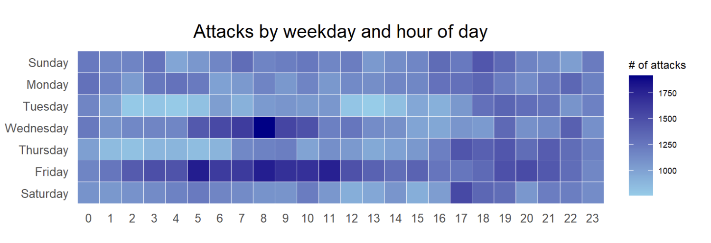
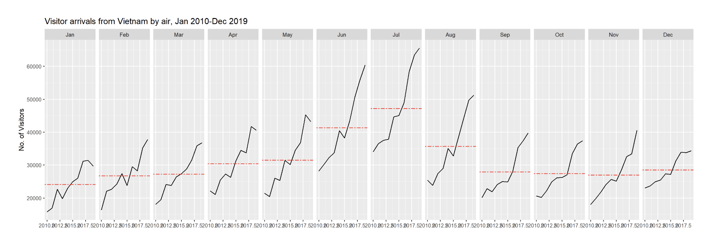

# 1. Overview

This exercise provides hands-on experience on the below data visualization:

-   plot a calendar heatmap using **ggplot2** functions,

-   plot a cycle plot using **ggplot2** function,

-   plot a slopegraph

-   plot a horizon chart

# 2. Getting Started

## 2.1. Install R packages

The below code chunks load and install the necessary packages into R environment.

```{r}
pacman::p_load(scales, viridis, lubridate, ggthemes, gridExtra, readxl, knitr, data.table, CGPfunctions, ggHoriPlot, tidyverse)
```

# 3. Plotting Calendar Heatmap

In this section, we explore how to plot a calender heatmap programmatically using **ggplot2**.


## 3.1.The Data

*eventlog.csv* file will be used for this hands-on exercise. This dataset consists of 199,999 rows of time-series cyber attack records by country.

## 3.2. Importing the data

The below code chunk imports *eventlog.csv* into R environment as a tibble dataframe named `attack`

```{r}
attacks <- read_csv("data/eventlog.csv")
```

## 3.3. Examining the data structure

The below code chunk uses`kable()` to review the structure of the imported data frame.

```{r}
kable(head(attacks))
```

The output shows there are three columns: *timestamp*, *source_country* and *tz*.

-   *timestamp*: stores date-time values in POSIXct format.

-   *source_country*: stores the source of the attack in *ISO 3166-1 alpha-2* country code.

-   *tz*: stores time zone of the source IP address.


## 3.4. Data Preparation

Step1: Before we can plot the calendar heatmap, the weekday and hour of the day need to be defined. The below code chunk creates these new fields named *wkday* and *hour*.

```{r}
make_hr_wkday <- function(ts, sc, tz) {
  real_times <- ymd_hms(ts, 
                        tz = tz[1], 
                        quiet = TRUE)
  dt <- data.table(source_country = sc,
                   wkday = weekdays(real_times),
                   hour = hour(real_times))
  return(dt)
  }
```

::: {.callout-tip title="Note"}

-   [`ymd_hms()`](https://lubridate.tidyverse.org/reference/ymd_hms.html) and [`hour()`](https://lubridate.tidyverse.org/reference/hour.html) are from [**lubridate**](https://lubridate.tidyverse.org/) package, and

-   [`weekdays()`](https://www.rdocumentation.org/packages/base/versions/3.6.2/topics/weekdays) is a **base** R function.
:::

Step 2: We derive the `attacks` tibble dataframe, using `mutate()` to convert *wkday* and *hour* fields into **factor** so they’ll be ordered when plotting.

```{r}
wkday_levels <- c('Saturday', 'Friday', 
                  'Thursday', 'Wednesday', 
                  'Tuesday', 'Monday', 
                  'Sunday')

attacks <- attacks %>%
  group_by(tz) %>%
  do(make_hr_wkday(.$timestamp, 
                   .$source_country, 
                   .$tz)) %>% 
  ungroup() %>% 
  mutate(wkday = factor(
    wkday, levels = wkday_levels),
    hour  = factor(
      hour, levels = 0:23))
```

::: {.callout-tip title="Note"}
Beside extracting the necessary data into attacks data frame, `mutate()` of `dplyr` package is used to convert wkday and hour fields into factor so they’ll be ordered when plotting
:::

The below code output shows the tidy tibble table after processing.

```{r}
kable(head(attacks))
```

## 3.5. Building the Calendar Heatmaps

```{r}
grouped <- attacks %>% 
  count(wkday, hour) %>% 
  ungroup() %>%
  na.omit()

ggplot(grouped, 
       aes(hour, 
           wkday, 
           fill = n)) + 
geom_tile(color = "white", 
          size = 0.1) + 
theme_tufte(base_family = "Helvetica") + 
coord_equal() +
scale_fill_gradient(name = "# of attacks",
                    low = "sky blue", 
                    high = "dark blue") +
labs(x = NULL, 
     y = NULL, 
     title = "Attacks by weekday and time of day") +
theme(axis.ticks = element_blank(),
      plot.title = element_text(hjust = 0.5),
      legend.title = element_text(size = 8),
      legend.text = element_text(size = 6) )
```

::: {.callout-tip title="Key takeaways from the above code chunk:"}

-   Data Aggregation: A tibble called `grouped` is created by aggregating `attack` occurrences by `wkday` and `hour`.

-   Count Calculation: A new field `n` is generated using `group_by()` and `count()`.

-   Handling Missing Values: `na.omit()` removes missing data.

-   Tile Plotting: `geom_tile()` plots grids at each `(x, y)` position, with `color` and `size` defining tile borders.

-   Minimalist Theme: `theme_tufte()` (from *ggthemes*) removes unnecessary elements; try commenting it out to see the default plot.

-   Aspect Ratio: `coord_equal()` ensures a 1:1 aspect ratio.

-   Color Scaling: `scale_fill_gradient()` creates a two-color gradient for visual contrast.
:::

## 3.6. Building Multiple Calendar Heatmaps

In this section, we explore how to plots multiple heatmaps for the top four countries with the highest number of attacks.

Step 1: Derive attack by country

In order to identify the top 4 countries with the highest number of attacks, we need to count the number of attacks by country and calculate the percent of attacks by country. Finally, save the ordered results in a tibble data frame.

```{r}
attacks_by_country <- count(
  attacks, source_country) %>%
  mutate(percent = percent(n/sum(n))) %>%
  arrange(desc(n))
```

Step 2: Prepare the tidy data frame

Next we extract the attack records of the top 4 countries from and save the data in a new tibble data frame call `top4_attacks`.

```{r}
top4 <- attacks_by_country$source_country[1:4]
top4_attacks <- attacks %>%
  filter(source_country %in% top4) %>%
  count(source_country, wkday, hour) %>%
  ungroup() %>%
  mutate(source_country = factor(
    source_country, levels = top4)) %>%
  na.omit()
```

## 3.7. Plot Multiple Calendar Heatmaps

Step 3: Finally, we plot the Multiple Calender Heatmap using ggplot2 functions.

```{r}
ggplot(top4_attacks, 
       aes(hour, 
           wkday, 
           fill = n)) + 
  geom_tile(color = "white", 
          size = 0.1) + 
  theme_tufte(base_family = "Helvetica") + 
  coord_equal() +
  scale_fill_gradient(name = "# of attacks",
                    low = "sky blue", 
                    high = "dark blue") +
  facet_wrap(~source_country, ncol = 2) +
  labs(x = NULL, y = NULL, 
     title = "Attacks on top 4 countries by weekday and time of day") +
  theme(axis.ticks = element_blank(),
        axis.text.x = element_text(size = 5.5),
        plot.title = element_text(hjust = 0.5),
        legend.title = element_text(size = 8),
        legend.text = element_text(size = 6) )
```

# 4. Plotting Cycle Plot

This section covers creating a cycle plot using `ggplot2` to visualize time-series patterns and trends in visitor arrivals from Vietnam.



## 4.1. Step 1: Data Import

The code chunk below uses `read_excel()` to imports *arrivals_by_air.xlsx* into a tibble data frame called `air`.

```{r}
air <- read_excel("data/arrivals_by_air.xlsx")
```

## 4.2. Step 2: Deriving month and year fields

Next, two new fields called *month* and *year* are derived from *Month-Year* field.

```{r}
air$month <- factor(month(air$`Month-Year`), 
                    levels=1:12, 
                    labels=month.abb, 
                    ordered=TRUE) 
air$year <- year(ymd(air$`Month-Year`))
```

## 4.3. Step 3: Extracting the target country

The below code chunk extracts data for the targeted country

```{r}
Vietnam <- air %>% 
  select(`Vietnam`, 
         month, 
         year) %>%
  filter(year >= 2010)
```

## 4.4. Step 4: Computing year average arrivals by month

The code chunk below uses `group_by()` and `summarise()` of **dplyr** to compute average arrivals by month.

```{r}
hline.data <- Vietnam %>% 
  group_by(month) %>%
  summarise(avgvalue = mean(`Vietnam`))
```

## 4.5. Step 5: Plotting the cycle plot

The below code chunk plots the cycle plot.

```{r}
ggplot() + 
  geom_line(data = Vietnam,
            aes(x = year, 
                y = `Vietnam`, 
                group = 1),  
            colour = "black") +
  geom_hline(data = hline.data, 
             aes(yintercept = avgvalue), 
             linetype = "dashed", 
             colour = "red", 
             size = 0.5) +
  facet_wrap(~ month, ncol = 6) + 
  labs(title = "Visitor arrivals from Vietnam by air, Jan 2010-Dec 2019",
       x = "",
       y = "No. of Visitors") +
  theme_tufte(base_family = "Helvetica") +
  theme(
    axis.text.x = element_blank(),
    panel.border = element_rect(colour = "grey80", fill = NA, size = 0.5),  
    panel.grid.major = element_line(colour = "grey90", size = 0.2),       
    strip.background = element_rect(fill = "grey90", color = NA)            
  )
```

# 5. Plotting Slopegraph

In this section, we explore how to plot a [slopegraph](https://www.storytellingwithdata.com/blog/2020/7/27/what-is-a-slopegraph) using R.

## 5.1. Step 1: Data Import

The below code chunk import rice.csv into R environment

```{r}
rice <- read_csv("data/rice.csv")
```

## 5.2. Step 2: Plotting the slopegraph

The below code chunk below plots a basic slopegraph. 
```{r}
rice %>% 
  mutate(Year = factor(Year)) %>%
  filter(Year %in% c(1961, 1980)) %>%
  newggslopegraph(Year, Yield, Country,
                Title = "Rice Yield of Top 11 Asian Counties",
                SubTitle = "1961-1980",
                Caption = "Prepared by: Phuong Nguyen")
```

::: {.callout-tip title="Thing to learn from the code chunk above"}
For effective visualization sorting, `factor()` is used to convert the value in Year from numeric to factor.
:::