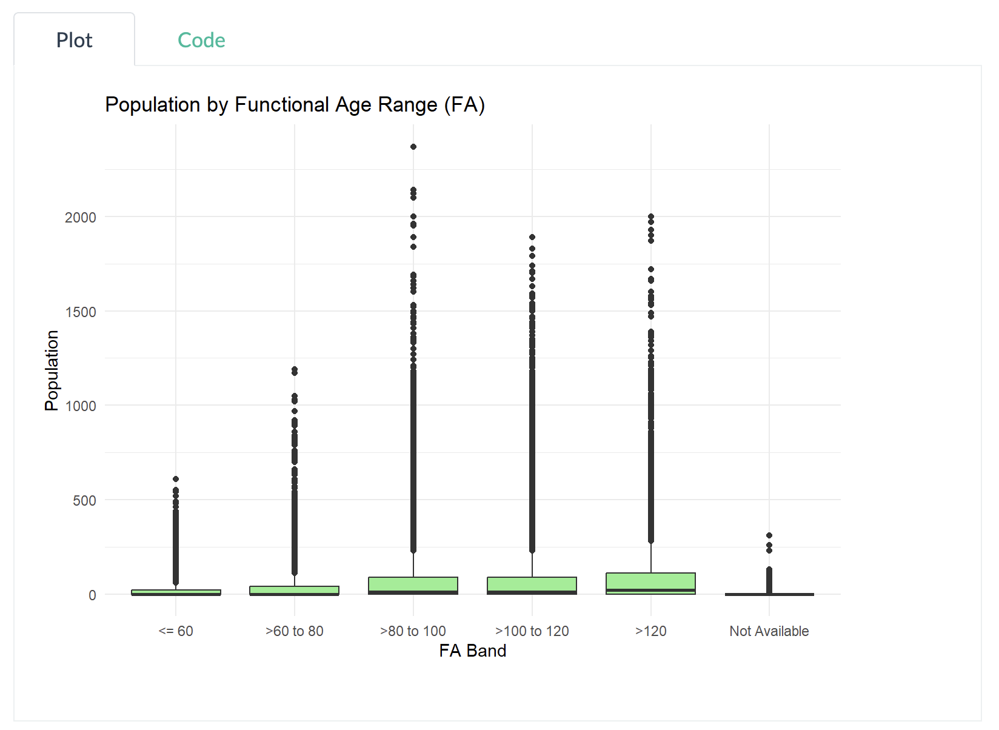

# 1. Overview

This exercise involves reviewing a classmate's submission - [Enrico Sebastian](https://iss608-vaa.netlify.app/take-home_ex/take-home_ex01/take%20home%20exercise%201). The review will identify three effective design principles applied and three areas where the visualization can be improved. Based on this feedback, a redesigned version of the data visualization will be created.

# 2. Importing data and packages

First, all of his used packages and data are loaded.

```{r, warning=FALSE}
library("pacman")
suppressWarnings(library("lubridate"))
library(readr)
```

```{r, warning=FALSE}
pacman::p_load(tidyverse, readxl, 
               janitor, lubridate, 
               ggplot2, ggthemes, 
               scales, ggridges, 
               ggdist, patchwork)
```

```{r, warning=FALSE}
Resident_Data <- read_csv("data/singapore_population.csv")
```

```{r, warning=FALSE}
Resident_Data <- Resident_Data %>%
  mutate(
    FA = case_when(
      Age <= 60 ~ "<= 60",
      Age > 60 & Age <= 80 ~ ">60 to 80",
      Age > 80 & Age <= 100 ~ ">80 to 100",
      Age > 100 & Age <= 120 ~ ">100 to 120",
      Age > 120 ~ ">120",
      TRUE ~ "Not Available"
    )
  )
```

# 3. Orignal visualization - Using Box Plot based on Age Range

-   **Purpose**: The classmate used a box plot to visually present the distribution and variability of the data, aiming to compare population distributions across different Functional Age (FA) Bands.

::: panel-tabset
### Plot

```{r, echo=FALSE}
FA_order <- c("<= 60", ">60 to 80", ">80 to 100", ">100 to 120", ">120", "Not Available")
Resident_Data$FA <- factor(Resident_Data$FA, levels = FA_order)

ggplot(Resident_Data, aes(x = FA, y = Pop)) +
  geom_boxplot(fill = "lightgreen") +
  labs(title = "Population by Functional Age Range (FA)", x = "FA Band", y = "Population") +
  theme_minimal()
```

### Code

```{r, eval=FALSE}
FA_order <- c("<= 60", ">60 to 80", ">80 to 100", ">100 to 120", ">120", "Not Available")
Resident_Data$FA <- factor(Resident_Data$FA, levels = FA_order)

ggplot(Resident_Data, aes(x = FA, y = Pop)) +
  geom_boxplot(fill = "lightgreen") +
  labs(title = "Population by Functional Age Range (FA)", x = "FA Band", y = "Population") +
  theme_minimal()
```
:::

::: {.callout-warning title="Note"}
Using the mate's provided code, the plot generated is differnt from the original one. For better interpretability, the original plot will be provided as image
:::

[**Original Plot**]{style="color:#2E86C1; background-color: #FFFF99;"}



**The classmate's plot interpretation**:

-   The population in the \>100 to 120 FA Band shows a wider spread and higher population values compared to the \<=60 FA Band.
-   A large spread in the \>100 to 120 FA Band indicates greater variability in population within this age range.
-   The median line is positioned higher in the box, suggesting a higher central tendency for this age band.
-   The presence of outliers in some bands indicates the existence of extreme population values.
-   These outliers suggest that certain age groups may have a more diverse or skewed distribution.

# 4. Three good design principles

::: {.callout-tip title="Three good design principles"}
1.  **Clear Axis Labels and Titles**: The x-axis (FA Band) and y-axis (Population) are clearly labeled, and the title “Population by Functional Age Range (FA)” clearly explains what the chart is about.

2.  **Outlier Visibility and Data Granularity**: The inclusion of individual data points (outliers) gives viewers more detailed insight into data distribution beyond quartiles.

3.  **Logical Ordering of Age Bands**: The FA Bands on the x-axis are ordered logically from youngest (\<=60) to oldest (\>120), which supports intuitive comparisons.
:::

# 5. Three areas for further improvement

::: {.callout-important title="Three areas for further improvement"}
1.  **Mismatch Between Data Type and Visualization Method**: Population count is a form of aggregated count data, not a continuous variable. Since box plots are best suited for showing distributions of continuous data, using them to display aggregated population values per FA Band may mislead viewers.

2.  **"Not Available" Treated as a Comparable Group**: Including "Not Available" as a FA Band on the same axis as valid ranges gives the false impression that it's a meaningful category for comparison. This could be misleading.

3.  **Lack of Summary Statistics Displayed**: While box plots visually encode the median and interquartile range, the exact values cannot be read directly from the chart, making it difficult to interpret in this case. Viewers are left to estimate the central tendency and spread, which may lead to misunderstanding.
:::

# 6. Makeover version

## 6.1. **How the makeover tackles the aforementioned limitations**:

```{r explanation-table, echo=FALSE, message=FALSE, warning=FALSE}
library(knitr)
library(tibble)

table_data <- tibble::tibble(
  `Original Issue` = c(
    "1. Mismatch Between Data Type and Visualization Method",
    "2. “Not Available” Treated as Comparable Group",
    "3. Lack of Summary Statistics Displayed"
  ),
  `Fix in Makeover` = c(
    "Uses **bar chart** for aggregated count data instead of boxplot, which is meant for continuous distribution.",
    "Explicitly **filters out 'Not Available'** to avoid misleading comparison with valid age bands.",
    "Displays **exact totals as labels** on bars, making the chart easily interpretable. No need to guess medians or IQRs."
  )
)

kable(table_data)
```

```{r}
library(ggplot2)
library(dplyr)

# Define FA Band order (without "Not Available")
FA_order <- c("<= 60", ">60 to 80", ">80 to 100", ">100 to 120", ">120")

# Step 1: Filter and recode factor
Resident_Data_Clean <- Resident_Data %>%
  filter(FA %in% FA_order) %>%
  mutate(FA = factor(FA, levels = FA_order))

# Step 2: Aggregate population per FA Band
summary_df <- Resident_Data_Clean %>%
  group_by(FA) %>%
  summarise(Total_Population = sum(Pop, na.rm = TRUE))

# Step 3: Bar chart
ggplot(summary_df, aes(x = FA, y = Total_Population, fill = FA)) +
  geom_col() +
  geom_text(aes(label = Total_Population), vjust = -0.5, size = 4) +
  labs(
    title = "Total Population by Functional Age Band (Excluding Not Available)",
    x = "FA Band",
    y = "Total Population"
  ) +
  theme_minimal() +
  theme(legend.position = "none")
```

## 6.2. **Addition**: Population is distributed across Planning Areas (PAs) within each Functional Age (FA) Band with `Interactivity`

::: panel-tabset

### The graph
```{r, echo=FALSE}
library(ggplot2)
library(dplyr)
library(plotly)

FA_order <- c("<= 60", ">60 to 80", ">80 to 100", ">100 to 120", ">120")

# Step 1: Clean and recode
Resident_Data_Clean <- Resident_Data %>%
  filter(FA %in% FA_order) %>%
  mutate(FA = factor(FA, levels = FA_order))

# Step 2: Aggregate population by FA and PA
summary_df <- Resident_Data_Clean %>%
  group_by(FA, PA) %>%
  summarise(Total_Population = sum(Pop, na.rm = TRUE), .groups = "drop") %>%
  filter(Total_Population > 0)  # ✅ Remove zero-population entries

# Step 3: Reorder PA (optional if not used as axis)
PA_order <- summary_df %>%
  group_by(PA) %>%
  summarise(Total_PA = sum(Total_Population)) %>%
  arrange(Total_PA) %>%
  pull(PA)

summary_df <- summary_df %>%
  mutate(PA = factor(PA, levels = PA_order))

# Step 4: Dot plot - y axis is population
p <- ggplot(summary_df, aes(x = FA, y = Total_Population, size = Total_Population, color = PA,
                            text = paste0(
                              "Planning Area: ", PA, "<br>",
                              "FA Band: ", FA, "<br>",
                              "Population: ", Total_Population
                            ))) +
  geom_point(alpha = 0.8) +
  scale_size_continuous(range = c(2, 10)) +
  labs(
    title = "Dot Plot: Population by FA Band and Planning Area",
    x = "FA Band",
    y = "Total Population",
    size = "Population",
    color = "Planning Area"
  ) +
  theme_minimal() +
  theme(axis.text.x = element_text(angle = 45, hjust = 1))

# Step 5: Make interactive
ggplotly(p, tooltip = "text") %>% layout(height = 800)
```

### The code
```{r, eval=FALSE}
library(ggplot2)
library(dplyr)
library(plotly)

FA_order <- c("<= 60", ">60 to 80", ">80 to 100", ">100 to 120", ">120")

# Step 1: Clean and recode
Resident_Data_Clean <- Resident_Data %>%
  filter(FA %in% FA_order) %>%
  mutate(FA = factor(FA, levels = FA_order))

# Step 2: Aggregate population by FA and PA
summary_df <- Resident_Data_Clean %>%
  group_by(FA, PA) %>%
  summarise(Total_Population = sum(Pop, na.rm = TRUE), .groups = "drop") %>%
  filter(Total_Population > 0)  # ✅ Remove zero-population entries

# Step 3: Reorder PA (optional if not used as axis)
PA_order <- summary_df %>%
  group_by(PA) %>%
  summarise(Total_PA = sum(Total_Population)) %>%
  arrange(Total_PA) %>%
  pull(PA)

summary_df <- summary_df %>%
  mutate(PA = factor(PA, levels = PA_order))

# Step 4: Dot plot - y axis is population
p <- ggplot(summary_df, aes(x = FA, y = Total_Population, size = Total_Population, color = PA,
                            text = paste0(
                              "Planning Area: ", PA, "<br>",
                              "FA Band: ", FA, "<br>",
                              "Population: ", Total_Population
                            ))) +
  geom_point(alpha = 0.8) +
  scale_size_continuous(range = c(2, 10)) +
  labs(
    title = "Dot Plot: Population by FA Band and Planning Area",
    x = "FA Band",
    y = "Total Population",
    size = "Population",
    color = "Planning Area"
  ) +
  theme_minimal() +
  theme(axis.text.x = element_text(angle = 45, hjust = 1))

# Step 5: Make interactive
ggplotly(p, tooltip = "text") %>% layout(height = 800)
```
:::
