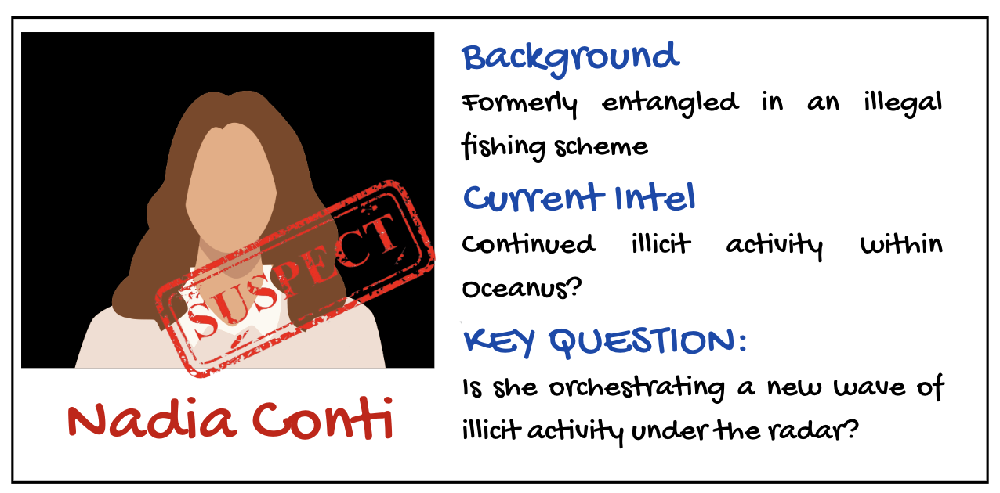
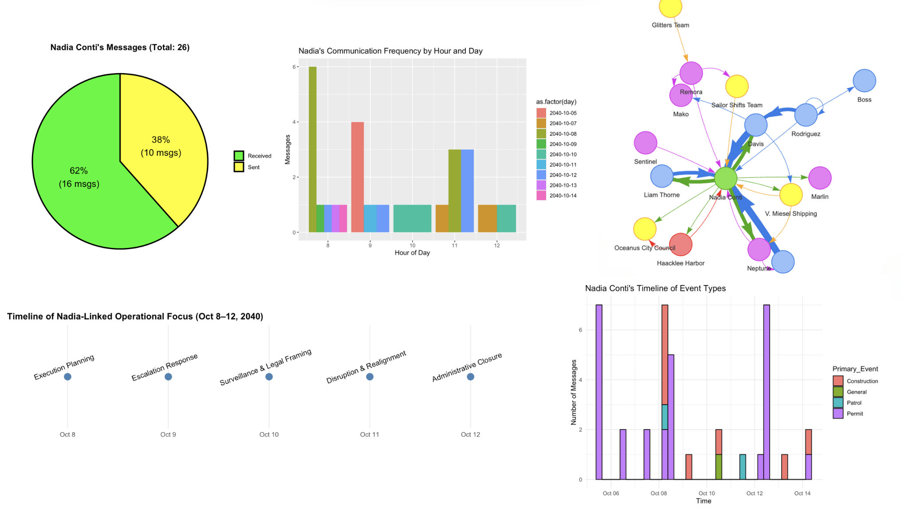
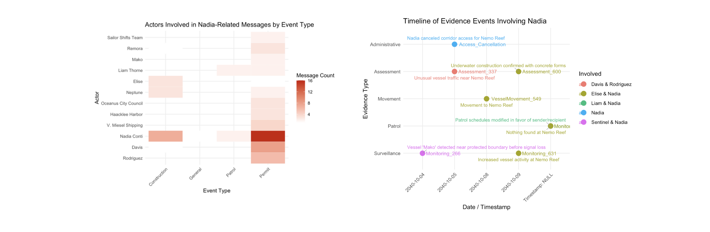

# 1. Setting the Scene

Oceanus, once reliant on fishing, has undergone significant changes in the past decade. As authorities cracked down on illegal fishing, many suspects redirected their investments into the booming ocean tourism sector. This shift brought new attention to the island, especially after pop star Sailor Shift announced plans to shoot a music video there.

Amidst these developments, journalist Clepper Jessen, formerly an analyst at FishEye—began investigating the sudden closure of Nemo Reef

# 2. Overview

This take-home exercise presents the following scenario:

Question 4: Clepper suspects that Nadia Conti, previously linked to an illegal fishing operation, may still be engaging in unlawful activities in Oceanus.

-   4a. Use visual analytics to determine whether there is evidence suggesting that Nadia is involved in any illegal actions.
-   4b. Summarize Nadia’s activities visually. Do the findings support Clepper’s suspicions?

This exercise invites you to embark on an investigative journey, where the truth behind the suspect — Nadia Conti — will gradually unfold.

## Summary of Nadia Conti profile



This suspect had been involved in an illegal fishing scheme. She is suspected that she may have continued illicit activity within Oceanus.

# 3. Case File Prepartion (Data Preparation)

The case file has been prepared and cleaned by the colleague Vanessa Riadi. Click [here](https://isss608-vriadi.netlify.app/take-home_ex/take-home_ex02/take-home_ex02#data-visualisation-observation-and-insights) to view full steps of case file preparation.

# 4. Equipping tools for investigation (Load packages)

Before deeping into the case, neccesary tools are equipped to serve the investigation process.

```{r}
knitr::opts_chunk$set(echo = TRUE)
library(tidyverse)
library(lubridate)
library(igraph)
library(ggraph)
library(wordcloud)
library(tidytext)
library(stopwords)
library(dplyr)
library(tibble)
library(visNetwork)
library(stringr)
library(knitr)
library(ggplot2)
library(readr)
library(jsonlite)
library(janitor)
library(forcats)
library(ggrepel)
```

# 5. Unpacking the case file

```{r}
messages <- read_csv("data/communications_full.csv")
```

The final case file contains those variables:

```{r, echo = FALSE}
kable(head(messages,2))
```

# 6. Filter Nadia's Communications and Communications related to Nadia

```{r}
nadia_msgs <- messages %>%
  filter(sender == "Nadia Conti" | receiver == "Nadia Conti")
```

```{r}
# Nadia's Communications
nadia_counts <- nadia_msgs %>%
  summarise(
    Sent = sum(sender == "Nadia Conti"),
    Received = sum(receiver == "Nadia Conti")
  ) %>%
  pivot_longer(cols = everything(), names_to = "Type", values_to = "Count") %>%
  mutate(
    Percent = Count / sum(Count),
    Label = paste0(round(Percent * 100), "%\n(", Count, " msgs)")
  )

total_msgs <- sum(nadia_counts$Count)
main_title <- paste0("Nadia Conti's Messages (Total: ", total_msgs, ")")

ggplot(nadia_counts, aes(x = "", y = Count, fill = Type)) +
  geom_col(width = 1, color = "black", size = 1) +  # ← Border color and size
  coord_polar(theta = "y") +
  geom_text(aes(label = Label), position = position_stack(vjust = 0.5), size = 5) +
  labs(title = main_title) +
  scale_fill_manual(values = c("Sent" = "yellow", "Received" = "green")) +
  theme_void() +
  theme(
    legend.title = element_blank(),
    plot.title = element_text(hjust = 0.5, face = "bold")
  )

# Communications mentioned Nadia
mentions_nadia <- messages %>%
  filter(str_detect(content, regex("Nadia|Nadia Conti", ignore_case = TRUE)))

mentions_nadia_by_others <- mentions_nadia %>%
  filter(sender != "Nadia Conti", receiver != "Nadia Conti")

count_mentions_by_others <- nrow(mentions_nadia_by_others)

cat("The number of messages that mention Nadia Conti but were not sent or received by her is:", count_mentions_by_others, "\n")
```

::: {style="
  border: 2px dotted #333333;
  border-radius: 8px;
  padding: 16px;
  background-color: #f3f3f3;
  font-family: 'Segoe UI', sans-serif;
  color: #1a1a1a;
  line-height: 1.6;
"}
**🕵️‍♂️ Investigation Note**

-   Nadia Conti received more than twice the number of messages she sent.
-   This asymmetry suggests that she was a central point of contact, potentially being sought out by others rather than initiating communication.
-   Such behavior may imply influence, authority, or involvement in sensitive operations.
-   Notably, there are **12 messages that mention Nadia Conti but were not sent or received by her**, indicating that she is **a subject of conversation or observation**, even when not directly involved in the exchange.

Let’s continue examining the timing and content of these indirect mentions to determine whether they represent coordination, reporting, or suspicion.
:::

# 7. Temporal Pattern of Nadia's Communications

```{r}
nadia_msgs <- nadia_msgs %>%
  mutate(time = ymd_hms(timestamp),
         hour = hour(time),
         day = as.Date(time))

nadia_msgs %>%
  count(day, hour) %>%
  ggplot(aes(x = hour, y = n, fill = as.factor(day))) +
  geom_col(position = "dodge") +
  labs(title = "Nadia's Communication Frequency by Hour and Day", x = "Hour of Day", y = "Messages")
```

```{r}
mentions_nadia <- mentions_nadia %>%
  mutate(time = ymd_hms(timestamp),
         hour = hour(time),
         day = as.Date(time))

# Plotting temporal pattern
mentions_nadia %>%
  count(day, hour) %>%
  ggplot(aes(x = hour, y = n, fill = as.factor(day))) +
  geom_col(position = "dodge") +
  labs(
    title = "Temporal Pattern of Messages Mentioning Nadia",
    x = "Hour of Day",
    y = "Number of Messages",
    fill = "Date"
  ) +
  theme_minimal()
```

::: {style="
  border: 2px dotted #333333;
  border-radius: 8px;
  padding: 16px;
  background-color: #f3f3f3;
  font-family: 'Segoe UI', sans-serif;
  color: #1a1a1a;
  line-height: 1.6;
"}
**🕵️‍♀️ Investigation Note: Communication Timing**

A dual analysis of **Nadia Conti’s** messaging activity and the messages referencing her reveals a synchronized temporal pattern centered around the **early morning hours (08:00–11:00)**.

-   **Nadia’s own communications** peak at **08:00 on 2040-10-08**, suggesting active initiation or participation in **early-day coordination**.\
-   **Mentions of Nadia** by others cluster similarly, with spikes on **2040-10-07** and **2040-10-12**, pointing to her being a topic of **strategic discussion** during morning briefings.

This alignment suggests Nadia may play a **central operational role**, either **directing plans** or being a **subject of surveillance or planning**.
:::

# 8. Nadia's Relationship Network Graph

## a. Direct Communication Network (Center = Nadia)

```{r}
nadia_edges <- nadia_msgs %>%
  count(sender_label, receiver_label) %>%
  filter(!is.na(sender_label), !is.na(receiver_label)) %>%
  rename(from = sender_label, to = receiver_label, value = n)

entity_info <- nadia_msgs %>%
  select(name = sender_label, type = sender_type) %>%
  bind_rows(nadia_msgs %>% select(name = receiver_label, type = receiver_type)) %>%
  distinct()

nadia_nodes <- tibble(name = unique(c(nadia_edges$from, nadia_edges$to))) %>%
  left_join(entity_info, by = "name") %>% 
  mutate(group = ifelse(name == "Nadia Conti", "Nadia Conti", type),
         id = name,
         label = name) %>%
  replace_na(list(group = "Unknown"))  

visNetwork(nodes = nadia_nodes, edges = nadia_edges) %>%
  visEdges(arrows = "to") %>%
  visOptions(highlightNearest = TRUE, nodesIdSelection = TRUE) %>%
  visLayout(randomSeed = 123) %>%
  visPhysics(stabilization = TRUE) %>%
  visInteraction(navigationButtons = TRUE) %>%
  visLegend()
```

## b. Mention Network (Center = Nadia, but not always direct link)

```{r}
mention_edges <- mentions_nadia %>%
  count(sender_label, receiver_label) %>%
  rename(from = sender_label, to = receiver_label, value = n)

# Step 3: Create node attribute table
entity_info <- mentions_nadia %>%
  select(name = sender_label, type = sender_type) %>%
  bind_rows(mentions_nadia %>% select(name = receiver_label, type = receiver_type)) %>%
  distinct()

mention_nodes <- tibble(name = unique(c(mention_edges$from, mention_edges$to))) %>%
  left_join(entity_info, by = "name") %>%
  mutate(
    group = ifelse(str_detect(name, "Nadia"), "Nadia", type),
    id = name,
    label = name
  ) %>%
  replace_na(list(group = "Unknown"))

# Step 4: Plot the network
visNetwork(nodes = mention_nodes, edges = mention_edges) %>%
  visEdges(arrows = "to") %>%
  visOptions(highlightNearest = TRUE, nodesIdSelection = TRUE) %>%
  visLayout(randomSeed = 123) %>%
  visPhysics(stabilization = TRUE) %>%
  visInteraction(navigationButtons = TRUE) %>%
  visLegend()
```

::: {style="
  border: 2px dotted #444;
  border-radius: 8px;
  padding: 16px;
  background-color: #f1f1f1;
  font-family: 'Segoe UI', sans-serif;
  color: #1a1a1a;
  line-height: 1.6;
"}
**🕵️‍♀️ Investigation Note: Nadia Conti’s Network Dynamics**

A dual network analysis reveals two distinct but overlapping roles played by **Nadia Conti** within the communication ecosystem: one as a **central communicator**, the other as a **frequent subject of discussion**.

-   In the **Direct Communication Network**, Nadia is the focal point of interactions, maintaining **high-volume, bidirectional exchanges** with a range of **individuals**, **organizations**, **vessels**, and **locations**. The diversity and intensity of these connections suggest she holds a **key operational or coordinating role**.

-   In contrast, the **Mention Network** portrays Nadia as a **recurrent topic in third-party conversations**, even when she is not directly involved. Entities such as **Sailor Shifts Team** and **Oceanus City Council** reference her in their communications, indicating she is **monitored, discussed, or consulted** in broader strategic contexts.

This combined view positions **Nadia Conti** as both a **core communicator** and a **strategic figure of interest**.
:::

## c. Nadia's Network involving Relationship, Associated Events

```{r, echo = FALSE}
library(readxl)
df <- read_excel("data/Nadia Conti_copy.xlsx")
```

```{r graph_from_df_detailed, message=FALSE, warning=FALSE}
df <- df %>% clean_names()

df <- df %>%
  mutate(
    rel_label = str_remove(relationship, "^Relationship_"),
    rel_label = str_remove(rel_label, "_\\d+$")
  )

df <- df %>%
  mutate(
    event_type = case_when(
      str_detect(event, "Event_Monitoring_") ~ "Monitoring",
      str_detect(event, "Event_Assessment_") ~ "Assessment",
      str_detect(event, "Event_VesselMovement_") ~ "VesselMovement",
      TRUE ~ "Other"
    )
  )

sender_nodes <- df %>%
  distinct(id = sender, label = sender, group = sender_type)

receiver_nodes <- df %>%
  distinct(id = receiver, label = receiver, group = receiver_type)

comm_nodes <- df %>%
  distinct(id = message_id, label = message_id, group = "Communication")

rel_nodes <- df %>%
  distinct(id = relationship, label = rel_label, group = "Relationship")

event_nodes <- df %>%
  distinct(id = event, label = event, group = event_type)

monitoring_entities <- df %>%
  filter(str_detect(event, "Event_Monitoring_")) %>%
  select(monitoring_type, findings, target, source) %>%
  pivot_longer(everything(), values_to = "id") %>%
  distinct(id) %>%
  mutate(label = id, group = "MonitoringAttribute")

assessment_entities <- df %>%
  filter(str_detect(event, "Event_Assessment_")) %>%
  select(assessment_type, results) %>%
  pivot_longer(everything(), values_to = "id") %>%
  distinct(id) %>%
  mutate(label = id, group = "AssessmentAttribute")

movement_entities <- df %>%
  filter(str_detect(event, "Event_VesselMovement_")) %>%
  select(movement_type, destination) %>%
  pivot_longer(everything(), values_to = "id") %>%
  distinct(id) %>%
  mutate(label = id, group = "MovementAttribute")

nodes <- bind_rows(
  sender_nodes,
  receiver_nodes,
  comm_nodes,
  rel_nodes,
  event_nodes,
  monitoring_entities,
  assessment_entities,
  movement_entities
) %>% distinct(id, .keep_all = TRUE)

edges1 <- df %>%
  transmute(from = sender, to = message_id)

edges2 <- df %>%
  transmute(from = message_id, to = receiver)

edges3 <- df %>%
  transmute(from = message_id, to = relationship)

edges4 <- df %>%
  transmute(from = message_id, to = event)

monitoring_edges <- df %>%
  filter(str_detect(event, "Event_Monitoring_")) %>%
  select(event, monitoring_type, findings, target, source) %>%
  pivot_longer(-event, values_to = "to") %>%
  transmute(from = event, to)

assessment_edges <- df %>%
  filter(str_detect(event, "Event_Assessment_")) %>%
  select(event, assessment_type, results) %>%
  pivot_longer(-event, values_to = "to") %>%
  transmute(from = event, to)

movement_edges <- df %>%
  filter(str_detect(event, "Event_VesselMovement_")) %>%
  select(event, movement_type, destination) %>%
  pivot_longer(-event, values_to = "to") %>%
  transmute(from = event, to)

edges <- bind_rows(edges1, edges2, edges3, edges4, monitoring_edges, assessment_edges, movement_edges) %>%
  filter(!is.na(from), !is.na(to))

visNetwork(nodes, edges) %>%
  visEdges(arrows = "to") %>%
  visOptions(highlightNearest = TRUE, nodesIdSelection = TRUE) %>%
  visLayout(randomSeed = 123) %>%
  visLegend()
```

::: {style="
  border: 2px dotted #444;
  border-radius: 8px;
  padding: 16px;
  background-color: #f6f6f6;
  font-family: 'Segoe UI', sans-serif;
  color: #1a1a1a;
  line-height: 1.6;
"}
**🕵️‍ Investigation Note**

This comprehensive network visualization, while not delivering an instant or singular insight, is extremely valuable in tracing the **entire structure of interactions**, particularly across **Communication**, **Event**, and **Relationship** nodes.

It allows:

-   Observe how entities like **Nadia Conti** interact with others through both direct and indirect links.
-   Trace **evidence paths** back to **events or inferred relationships** (e.g., Colleague, Suspicious).
-   Identify clusters, recurring actors, and potential outliers.
-   Explore **multi-hop connections** that may reveal hidden influences or coordinated behavior.
:::

# 9. Analyzing contents in Nadia's communications by date

## a. October 8th

```{r}
nadia_related <- bind_rows(nadia_msgs, mentions_nadia_by_others) %>%
  distinct(message_id, .keep_all = TRUE)

data("stop_words")

messages_oct8 <- nadia_related %>%
  filter(date(timestamp) == as.Date("2040-10-08")) %>%
  filter(!is.na(content), content != "")

top_words_oct8 <- messages_oct8 %>%
  unnest_tokens(word, content) %>%
  filter(!word %in% stop_words$word) %>%
  count(word, sort = TRUE) %>%
  slice_max(n, n = 20)

ggplot(top_words_oct8, aes(x = reorder(word, n), y = n)) +
  geom_col(fill = "#2171b5") +
  coord_flip() +
  labs(title = "Top Keywords in Nadia-Related Messages (Oct 8, 2040)",
       x = "Keyword", y = "Frequency") +
  theme_minimal()
```

::: {style="
  border: 2px dotted #444;
  border-radius: 8px;
  padding: 16px;
  background-color: #f9f9f9;
  font-family: 'Segoe UI', sans-serif;
  color: #1a1a1a;
  line-height: 1.6;
"}
**🕵️‍ Investigation Note: Keyword Patterns Suggest Nadia’s Strategic Role on October 8**

-   On **October 8**, the term *nadia* dominates keyword frequency, confirming she is at the center of message activity.\
-   High-ranking keywords such as **reef**, **nemo**, **neptune**, and **marina** suggest operational ties to maritime locations—particularly around **Nemo Reef**, a previously flagged hotspot.\
-   Terms like **foundation**, **equipment**, and **modified** imply **ongoing construction or infrastructure adjustments**, likely related to permit or logistics planning.\
-   Temporal indicators such as **tomorrow** and **tonight** reflect **time-sensitive coordination**, possibly for execution phases or inspections.\
-   The presence of **davis**, **elise**, and **mako** reinforces the idea of a **multi-party operation**, where Nadia may be issuing directives or receiving critical updates.\
-   Keywords like **payment**, **documentation**, and **finalize** may indicate backend efforts to legitimize or complete operations—possibly tied to permitting or coverup.
:::

## b. October 9th

```{r}
data("stop_words")

messages_oct9 <- nadia_related %>%
  filter(date(timestamp) == as.Date("2040-10-09")) %>%
  filter(!is.na(content), content != "")

top_words_oct9 <- messages_oct9 %>%
  unnest_tokens(word, content) %>%
  filter(!word %in% stop_words$word) %>%
  count(word, sort = TRUE) %>%
  slice_max(n, n = 20)

ggplot(top_words_oct9, aes(x = reorder(word, n), y = n)) +
  geom_col(fill = "#2171b5") +
  coord_flip() +
  labs(title = "Top Keywords in Nadia-Related Messages (Oct 9, 2040)",
       x = "Keyword", y = "Frequency") +
  theme_minimal()
```

::: {style="
  border: 2px dotted #444;
  border-radius: 8px;
  padding: 16px;
  background-color: #f9f9f9;
  font-family: 'Segoe UI', sans-serif;
  color: #1a1a1a;
  line-height: 1.6;
"}
**🕵️‍ Investigation Note: Oct 9 Messages Suggest Escalation and Operational Urgency**

-   The uniform keyword distribution indicates **broad coverage across themes**, rather than dominance by a few topics—suggesting a **multi-faceted coordination day**.\
-   Words like **urgent**, **escalating**, and **contingencies** highlight a shift toward **crisis response or risk mitigation**, possibly reacting to earlier operations or external scrutiny.\
-   The inclusion of **underwater**, **installation**, **concrete**, and **structures** implies **active engineering work**, potentially below surface level at or near **Nemo Reef**.\
-   Presence of **clarification**, **confirmed**, and **forms** points to **paperwork, documentation, or verification processes**, possibly in response to oversight or audit.\
-   Names like **elise**, **miesel’s**, and **sam** imply involvement of multiple actors and may reflect distributed tasking or compartmentalized responsibilities.\
-   Together, these terms suggest Nadia may be coordinating a **rapid deployment or adjustment phase**—balancing both **physical site actions** and **administrative coverage**.
:::

## c. October 10th

```{r}
data("stop_words")

messages_oct10 <- nadia_related %>%
  filter(date(timestamp) == as.Date("2040-10-10")) %>%
  filter(!is.na(content), content != "")

top_words_oct10 <- messages_oct10 %>%
  unnest_tokens(word, content) %>%
  filter(!word %in% stop_words$word) %>%
  count(word, sort = TRUE) %>%
  slice_max(n, n = 20)

ggplot(top_words_oct10, aes(x = reorder(word, n), y = n)) +
  geom_col(fill = "#2171b5") +
  coord_flip() +
  labs(title = "Top Keywords in Nadia-Related Messages (Oct 10, 2040)",
       x = "Keyword", y = "Frequency") +
  theme_minimal()
```

::: {style="
  border: 2px dotted #444;
  border-radius: 8px;
  padding: 16px;
  background-color: #f9f9f9;
  font-family: 'Segoe UI', sans-serif;
  color: #1a1a1a;
  line-height: 1.6;
"}
**🕵️‍ Investigation Note: Oct 10 Messages Emphasize Surveillance, Motives & Administrative Cover**

-   Keywords such as **reef**, **nemo**, and **nadia** remain highly prominent, maintaining the geographic and leadership focus around **Nemo Reef operations**.\
-   A strong presence of terms like **ulterior**, **suspect**, **surveillance**, and **motives** indicates **internal concern or monitoring**—possibly suggesting either external threat assessment or internal scrutiny.\
-   References to **financial**, **claims**, **evidence**, **closure**, and **council** imply **administrative or legal maneuvering**, hinting at preparations for regulatory defense or policy justification.\
-   Technical terms such as **parameters**, **tests**, **connection**, **alternate**, and **adaptation** reflect **reactive measures** or system adjustments, likely tied to maintaining operational integrity.\
-   The appearance of **scientific**, **conservation**, and **city** points toward **public-facing narratives or environmental justifications**, possibly being prepared to support legitimacy.\
-   Taken together, the October 10 keyword profile reflects a shift from action to **risk management, political positioning, and narrative control**.
:::

## d. October 11th

```{r}
data("stop_words")

messages_oct11 <- nadia_related %>%
  filter(date(timestamp) == as.Date("2040-10-11")) %>%
  filter(!is.na(content), content != "")

top_words_oct11 <- messages_oct11 %>%
  unnest_tokens(word, content) %>%
  filter(!word %in% stop_words$word) %>%
  count(word, sort = TRUE) %>%
  slice_max(n, n = 20)

ggplot(top_words_oct11, aes(x = reorder(word, n), y = n)) +
  geom_col(fill = "#2171b5") +
  coord_flip() +
  labs(title = "Top Keywords in Nadia-Related Messages (Oct 11, 2040)",
       x = "Keyword", y = "Frequency") +
  theme_minimal()
```

::: {style="
  border: 2px dotted #444;
  border-radius: 8px;
  padding: 16px;
  background-color: #f9f9f9;
  font-family: 'Segoe UI', sans-serif;
  color: #1a1a1a;
  line-height: 1.6;
"}
**🕵️‍ Investigation Note: Oct 11 Keywords Indicate Disruption, Surveillance & Response Planning**

-   The appearance of terms like **suspicious**, **questioning**, and **redirected** points to a day marked by **disruption or external scrutiny**, likely triggering internal reassessment.\
-   Location-based terms such as **southwest**, **northern**, and **quadrant** hint at **regional segmentation of activity**, possibly indicating where operations were either moved or monitored.\
-   Keywords like **rov**, **ecovigil**, and **clean** imply use of **remote or environmental surveillance systems**, suggesting heightened visibility or a cover effort.\
-   The pairing of **delay**, **contingency**, and **immediately** strongly suggests **crisis mitigation measures**—either in planning or active execution.\
-   Nadia and **Liam** are both mentioned, reinforcing the likelihood of **collaborative leadership** responding in real time.\
-   The inclusion of **operations**, **plan**, and **clean** suggests that Oct 11 was a **day of strategic pivot**—realigning efforts to neutralize exposure or consolidate prior actions.
:::

## e. October 12th

```{r}
data("stop_words")

messages_oct12 <- nadia_related %>%
  filter(date(timestamp) == as.Date("2040-10-12")) %>%
  filter(!is.na(content), content != "")

top_words_oct12 <- messages_oct12 %>%
  unnest_tokens(word, content) %>%
  filter(!word %in% stop_words$word) %>%
  count(word, sort = TRUE) %>%
  slice_max(n, n = 20)

ggplot(top_words_oct12, aes(x = reorder(word, n), y = n)) +
  geom_col(fill = "#2171b5") +
  coord_flip() +
  labs(title = "Top Keywords in Nadia-Related Messages (Oct 12, 2040)",
       x = "Keyword", y = "Frequency") +
  theme_minimal()
```

::: {style="
  border: 2px dotted #444;
  border-radius: 8px;
  padding: 16px;
  background-color: #f9f9f9;
  font-family: 'Segoe UI', sans-serif;
  color: #1a1a1a;
  line-height: 1.6;
"}
**🕵️‍ Investigation Note: Oct 12 Shows Administrative Push and Coordinated Movement**

-   **Nadia**, **permit**, and **meeting** lead the keyword count, signaling a day focused on **structured coordination**, formalities, and approvals.\
-   Terms like **7844**, **cr**, **0600**, and **2100** suggest **precise scheduling**, perhaps involving coded operations or shift-based execution.\
-   Frequent mentions of **documentation**, **team**, **security**, and **update** point to **active enforcement and reporting**—possibly to align with oversight timelines.\
-   The inclusion of **tourism**, **closure**, **confidentiality**, and **appearance** signals concern about **public visibility and narrative control**, potentially related to surface-level legitimacy.\
-   **Rodriguez**, **miesel**, **davis**, **remora**, and **neptune** all appear, indicating **multi-actor mobilization** across personnel and vessels.\
-   Overall, Oct 12 reflects a **day of heavy logistical enforcement and media-sensitive planning**, likely to wrap or pivot operations with minimal disruption.
:::

## f. Timeline of Nadia-Linked Operational Focus (Oct 8–12, 2040)

```{r timeline-focus, echo=FALSE, fig.height=2.5, fig.width=10, warning=FALSE, message=FALSE}
library(ggplot2)
library(dplyr)

# Data frame
df <- data.frame(
  Date = factor(c("Oct 8", "Oct 9", "Oct 10", "Oct 11", "Oct 12"), levels = c("Oct 8", "Oct 9", "Oct 10", "Oct 11", "Oct 12")),
  Focus = c(
    "Execution Planning",
    "Escalation Response",
    "Surveillance & Legal Framing",
    "Disruption & Realignment",
    "Administrative Closure"
  )
)

# Plot
ggplot(df, aes(x = Date, y = 1)) +
  geom_line(linewidth = 1.2, color = "steelblue") +
  geom_point(size = 4, color = "steelblue") +
  ylim(0.95, 1.05) +
  theme_minimal() +
  theme(
    axis.title = element_blank(),
    axis.text.y = element_blank(),
    axis.ticks.y = element_blank(),
    panel.grid.major.y = element_blank(),
    panel.grid.minor = element_blank(),
    plot.title = element_text(face = "bold", size = 12)
  ) +
  ggtitle("Timeline of Nadia-Linked Operational Focus (Oct 8–12, 2040)") +
  geom_text(aes(label = Focus), vjust = -1.5, angle = 20, size = 3.5)
```

# 10. Nadia's involvement across event types

In this stage, those top keywords will be classified into different types.

```{r nadia-timeline, message=FALSE, warning=FALSE}
event_keywords <- list(
  Permit = c("permit", "approval", "cr-7844", "documentation", "expedite", "sign[- ]?off"),
  Construction = c("underwater foundation", "equipment", "build", "structure", "concrete"),
  Patrol = c("patrol", "reroute", "surveillance", "harbor master", "schedule", "redirect"),
  Coordination = c("meet", "confirm", "setup", "staff", "shift", "manifest"),
  Bribery = c("payment", "fee", "double", "favor", "compensation"),
  CoverUp = c("destroy", "cancel", "unaware", "discreet", "nothing to be concerned")
)

classify_event_primary <- function(text) {
  for (type in names(event_keywords)) {
    pattern <- paste(event_keywords[[type]], collapse = "|")
    if (str_detect(tolower(text), pattern)) {
      return(type)
    }
  }
  return("General")
}

nadia_related <- nadia_related %>%
  mutate(Primary_Event = sapply(content, classify_event_primary))

ggplot(nadia_related, aes(x = timestamp, fill = Primary_Event)) +
  geom_histogram(binwidth = 3600 * 6, color = "black", position = "stack") +
  labs(title = "Nadia Conti's Timeline of Event Types",
       x = "Time", y = "Number of Messages") +
  theme_minimal() +
  theme(legend.position = "right")
```

::: {style="
  border: 2px dotted #444;
  border-radius: 8px;
  padding: 16px;
  background-color: #f6f6f6;
  font-family: 'Segoe UI', sans-serif;
  color: #1a1a1a;
  line-height: 1.6;
"}
**🕵️ Investigation Note: Nadia’s Timeline Reveals a Sharp Surge in High-Risk Events**

-   **October 8–10**: Nadia is simultaneously involved in **Permit**, **Construction**, and **Patrol** event types — an uncommon triad that aligns with suspicious activity spikes across the overall timeline.\
-   **Construction-related activity** by Nadia spikes only during these days — suggesting her involvement is both **selective** and **strategic**.\
-   Nadia maintains a **persistent role in Permit operations**, with consistent involvement across multiple dates — notably **Oct 6, 8, 12, and 14**.\
-   **Bribery and CoverUp events**, though present in the broader dataset, are **absent from Nadia’s direct messages**, indicating possible **delegation** of those actions to others (e.g., Davis, Liam).
:::

```{r cooccurrence-heatmap, message=FALSE, warning=FALSE}

nadia_actor_events <- nadia_related %>%
  select(sender, receiver, Primary_Event) %>%
  pivot_longer(cols = c(sender, receiver), names_to = "role", values_to = "actor") %>%
  group_by(actor, Primary_Event) %>%
  summarise(n = n(), .groups = "drop") %>%
  group_by(actor) %>%
  filter(sum(n) >= 2) %>%  
  ungroup()

ggplot(nadia_actor_events, aes(x = Primary_Event, y = fct_reorder(actor, -n), fill = n)) +
  geom_tile(color = "white") +
  scale_fill_gradient(low = "white", high = "#cc0000") +
  labs(title = "Actors Involved in Nadia-Related Messages by Event Type",
       x = "Event Type", y = "Actor",
       fill = "Message Count") +
  theme_minimal() +
  theme(axis.text.x = element_text(angle = 45, hjust = 1))
```

::: {style="
  border: 2px dotted #444;
  border-radius: 8px;
  padding: 16px;
  background-color: #f9f9f9;
  font-family: 'Segoe UI', sans-serif;
  color: #1a1a1a;
  line-height: 1.6;
"}
**🕵️ Investigation Note: Heatmap Shows Nadia as a Central Node in Permits & Construction**

-   Nadia has the **highest message count** in the *Permit* category among all actors, underscoring her central role in legal/administrative coordination.\
-   She is also **one of the few actors** with meaningful volume in both *Permit and Construction*, making her **one of the only actors bridging planning and execution**.\
-   **Others like Davis, V. Miesel, and Liam** are also highly involved in Permit-related exchanges but show less overlap across multiple event types.\
-   **Actors like Elise and Neptune** have moderate involvement in *Construction* — suggesting they are **co-executors** or **operational contacts** under Nadia’s direction.
:::

# 11. Investigating other event types occured from Oct 8th to Oct 12th

Using the network chart in Part 8c, other events associated with Nadia-related Event_Communication can be extracted. Those events are:

```{r nadia-evidence-timeline-better-labels, message=FALSE, warning=FALSE}
event_data <- tibble::tibble(
  Date = as.Date(c("2040-10-04", "2040-10-05", "2040-10-05", "2040-10-08", 
                   "2040-10-09", "2040-10-09", NA, NA)),
  Event_ID = c("Monitoring_266", "Assessment_337", "Access_Cancellation",
               "VesselMovement_549", "Monitoring_631", "Assessment_600",
               "Monitoring_534", "Monitoring_722"),
  Evidence_Type = c("Surveillance", "Assessment", "Administrative",
                    "Movement", "Surveillance", "Assessment",
                    "Patrol", "Patrol"),
  Involved = c("Sentinel & Nadia", "Davis & Rodriguez", "Nadia",
               "Elise & Nadia", "Elise & Nadia", "Elise & Nadia",
               "Liam & Nadia", "Elise & Nadia"),
  Findings = c(
    "Vessel 'Mako' detected near protected boundary before signal loss",
    "Unusual vessel traffic near Nemo Reef",
    "Nadia canceled corridor access for Nemo Reef",
    "Movement to Nemo Reef",
    "Increased vessel activity at Nemo Reef",
    "Underwater construction confirmed with concrete forms",
    "Patrol schedules modified in favor of sender/recipient",
    "Nothing found at Nemo Reef"
  )
)

event_data <- event_data %>%
  mutate(Date_Label = ifelse(is.na(Date), "Timestamp: NULL", as.character(Date)),
         Date_Factor = fct_inorder(Date_Label))

ggplot(event_data, aes(x = Date_Factor, y = fct_rev(Evidence_Type), color = Involved)) +
  geom_point(size = 4) +
  geom_text(aes(label = Event_ID), hjust = -0.1, size = 3.2) +
  ggrepel::geom_text_repel(aes(label = Findings),
                           size = 3, max.overlaps = 20,
                           direction = "y", box.padding = 0.5,
                           segment.color = "gray60", segment.size = 0.3) +
  labs(
    title = "Timeline of Evidence Events Involving Nadia",
    x = "Date / Timestamp", y = "Evidence Type"
  ) +
  theme_minimal() +
  theme(axis.text.x = element_text(angle = 45, hjust = 1))
```

::: {style="
  border: 2px dotted #444;
  border-radius: 8px;
  padding: 16px;
  background-color: #f9f9f9;
  font-family: 'Segoe UI', sans-serif;
  color: #1a1a1a;
  line-height: 1.6;
"}
**🕵️ Investigation Note: Suspicious Patterns Implicating Nadia in Strategic Concealment**

-   On **Oct 5**, Nadia revoked corridor access to Nemo Reef just **one day prior** to the detection of **unusual vessel traffic** and **underwater concrete construction**, suggesting deliberate shielding of covert activity.\
-   **Construction with concrete forms** was reported immediately after the restricted access—raising concern over **pre-planned illicit infrastructure deployment**.\
-   A vessel was confirmed to have moved to Nemo Reef (**Oct 8**), yet official inspection on **Oct 9** reported “**Nothing found**,” indicating **possible concealment or temporary installation**.\
-   **Patrol schedules were adjusted** in favor of sender/recipient parties, pointing to internal manipulation to **evade oversight** during key activity windows.\
-   Simultaneous to this, **vessel ‘Mako’** was detected near a protected boundary before **signal loss**, and **increased vessel activity** was observed—hinting at a **coordinated breach**.\
-   Notably, Nadia’s messages **avoid any direct reference to bribery or coverup**, despite their appearance elsewhere in the dataset. This may reflect **delegation of risk** to parties like **Davis or Liam**, insulating her from direct exposure.

These alignments strongly suggest that **Nadia Conti played a calculated orchestration role**— managing operations, concealing presence, and relying on others to execute or absorb liability. Her behavioral footprint spans **administrative control**, **movement coordination**, and **strategic messaging omission**, forming a profile consistent with **compartmentalized command in covert activity**.
:::

# 12. Summary of key findings

 

:::: {style="
  border: 2px dotted #444;
  border-radius: 8px;
  padding: 16px;
  background-color: #f9f9f9;
  font-family: 'Segoe UI', sans-serif;
  color: #1a1a1a;
  line-height: 1.6;
"}
**🕵️ Investigation Summary: Nadia Conti's Activities**

**1. Communication Patterns**

-   **62% of messages were received** by Nadia, with the rest sent—**suggesting her central but reactive role.**
-   **Temporal concentration**: High frequency around **Oct 8–9**, notably around **8–11 AM**, correlates with coordination hours for logistics and surveillance.

**2. Message Timeline by Event Type**

-   Nadia’s messages largely relate to **Permits**, followed by **Construction** and **Patrol** — **domains critical to legitimizing and shielding site activities.**
-   **Spike in Permit + Construction messages on Oct 8** aligns with **surveillance and vessel movement around Nemo Reef.**

**3. Keyword Analysis (Oct 8)**

-   Frequent terms: `"equipment"`, `"foundation"`, `"payment"`, `"modified"`, `"meeting"`, `"document"`, `"marina"`.
-   **Suggestive of covert preparation**: approvals, underwater foundation work, coordination, and movement.

**4. Network Analysis**

-   Nadia is **the central hub**, receiving and sending messages to key players (**Neptune**, **Elise**, **Davis**, **Miesel Shipping**).
-   **Directionality** shows she’s **not just a participant but the orchestrator**, funneling information between entities.

**5. Timeline of External Evidence**

-   **Oct 5–9**: Several **independent surveillance reports and assessments** verify:
-   **Mako’s suspicious proximity**
-   **Unauthorized underwater construction**
-   **Redirected patrol schedules**
-   **Elise & Nadia exchanges confirming documentation and coordination**

## Conclusion: Do the Visual Findings Support Clepper’s Suspicion?

**Yes. Strongly.**

-   The **alignment between Nadia’s peaks in communication, permit-handling, and confirmed movement/construction** at Nemo Reef (despite her claiming cancellation) **supports Clepper’s suspicion.**
-   Even without direct messages showing illicit orders, **visual analytics** indicate:
    -   Nadia **controlled logistics, timelines, and access**
    -   **Delegated riskier operations** (e.g., payment, surveillance diversion) to others
    -   **Obfuscated true operations** under legal cover (permits)

<div>

</div>
::::
